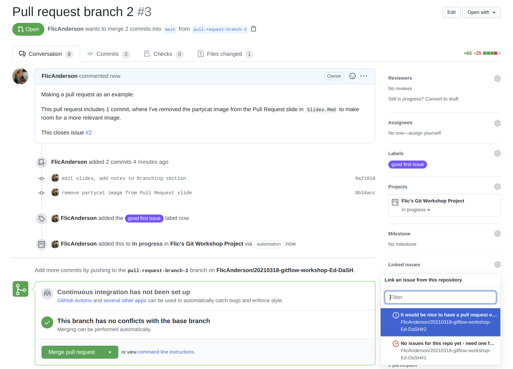
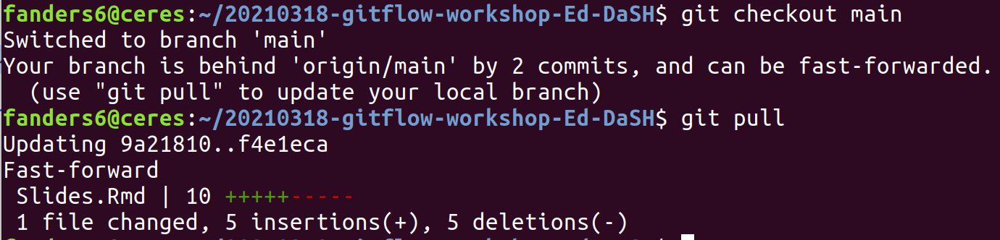

```{r setup, include=FALSE}
knitr::opts_chunk$set(echo = FALSE)
```

<script src="https://ajax.googleapis.com/ajax/libs/jquery/1.12.2/jquery.min.js"></script>

<script>
    $(document).ready(function() {
      $('slide:not(.title-slide, .backdrop, .segue)').append('<footer label=\"bit.ly/Ed-DaSH-git"></footer>');    
    })
</script>

<style>
  footer:after {
    content: attr(label);
    font-size: 12pt;
    position: absolute;
    bottom: 20px;
    left: 100px;
    line-height: 1.9;
  }
</style>

<style type="text/css">
slides > slide:not(.nobackground):after {
  content: '';
}
</style>

## HOW TO (RE-)USE THIS MATERIAL

This is a `.html` presentation created in `R Markdown` with `ioslides`. 

(It's been written in a [.Rmd](http://rmarkdown.rstudio.com) file, and we generated .html slides by 'knitting' it in Rstudio.)

You can check out the code used to make these slides at the [Workshop repo](https://github.com/FlicAnderson/20210318-gitflow-workshop-Ed-DaSH) on Github (and the [workshop materials it's based on](https://bit.ly/wallace-lab-git)), and adapt it for your own presentations if you like - I've got a MIT Licence on the repo, which means: 

*"Basically, you can do whatever you want as long as you include the original copyright and license notice in any copy of the software/source."*

Source: [tl;drLegal](https://tldrlegal.com/license/mit-license)

#  Things I wish I'd known sooner about working in a team with Git & GitHub

## Outline: 

* Intro to Git, GitHub
* The Git Workflow
* Issue Tickets
* Branching
* Pull Requests (PRs)
* Helpful Materials
* Questions

# Intro:

## Git

**Git** is a *version control system*. 

* It doesn't copy your files, as much as keep track of all `changes` ever since you told git to `add` the file to its logs
* Best for `text` files; can't see 'into' binaries (e.g. pdfs, pics)
* Saves the changes you tell it to `commit` to its log in project-specific folders referred to as a repository, or `repo`
* Very useful: undo/redo, backups, switching computers, safely 'experimenting'

It can be used via *Command Line* (the terminal!) or via a *Graphical User Interface* (GUI), on pretty much all systems.

## GitHub

**GitHub** is an *online platform* for storing your git repository. There are others (e.g. GitLab, Bitbucket).

* Keep track of all your repos online - `public` or `private`
* You can tell git to `push` its list of your file changes up to GitHub.
* Or `pull` changes down (yours or someone else's!) and `merge` them with your local copies. 
* Contribute to others' work via a `pull request` 

## Git Workflow {.flexbox .vcenter}

Fork

Clone

Branch

Edit

Add

Commit

Push

Pull Request

Merge


<div class="notes">

Fork: when we 'copy' a pre-existing repository to our GitHub account from a different one so we can work on it. This happens on GitHub

Clone: when we download / copy a repository to our LOCAL machine (usually from a remote one hosted on GitHub/etc.). We get the info from GitHub and do the clone onto a location on our local machine.

Branch: when we make another version of the existing code which will let us make changes and test new features without breaking anything else

Edit: when we change existing files or add new files 

Add: when we move selected (edited) files to the 'staging area' locally (this lets us notify git that we want to record any changes we've made to this file 'now')

Commit: when we add a 'commit message' to explain our changes. This command 'snapshots' our changes to these selected files.

Push: when we 'push' these snapshots of changes from our LOCAL machine to our REMOTE repository (on GitHub) - this makes them visible to everyone!

Pull Request: when we want to add the changes we've made in our branch to the main 'codebase' (or file-base!) of the repository officially (when it's finished!)

Merge: when we've approved the pull request, our code gets 'merged' into the main codebase and the changes overwrite/add to the existing files (depending on repository permissions).

</div>

## Git Workflow

<div class="centered">
```{r, out.width = "650"}
knitr::include_graphics("https://res.cloudinary.com/practicaldev/image/fetch/s--M_fHUEqA--/c_limit%2Cf_auto%2Cfl_progressive%2Cq_auto%2Cw_880/https://thepracticaldev.s3.amazonaws.com/i/128hsgntnsu9bww0y8sz.png")
``` 
</div>

## Commits

Commits are the way in which we save a snapshot of the changes in all the files our repository is watching. 

Don't commit big files everything - add things to `.gitignore` file

Each commit gets a 'hash' which lets you refer to specific commits (e.g. [`fcd1dba`](https://github.com/FlicAnderson/20210318-gitflow-workshop-Ed-DaSH/commit/fcd1dba23d1d60e8730a1017dc504d199f4ad2b8))

<div class="centered">
```{r, out.width = "750"}
knitr::include_graphics("https://raw.githubusercontent.com/FlicAnderson/20210318-gitflow-workshop-Ed-DaSH/main/images/commit_fileview.png")
``` 

## Commits

View side-by-side changes included in commits on GitHub:

<div class="centered">
```{r, out.width = "750"}
knitr::include_graphics("https://raw.githubusercontent.com/FlicAnderson/20210318-gitflow-workshop-Ed-DaSH/main/images/commit_sidebysideview.png")
``` 

<div class="notes">

* like a videogame 'save' 
* you can refer to specific commits (helpful when you're communicating to others what changes you've made)
* when you click the commit hash in github, you can get a side-by-side comparison of what changes are included in that commit
* .gitignore - a text file where you can add files that you DON'T want git to track. You could include any large binary files here (e.g. video) or intermediate/temporary files

</div>

## How To Write A Good Commit Message

`git commit -m "..."`

Be concise & consistent!

* WHAT did you do (e.g. fix, rework, add, update)
* WHERE (e.g. filename, function name, section of paper, variable)

`git commit -m "add resources section to 'README.md'"`

# Issue Tickets 

## Issue Tickets 

* GitHub tool: create 'issues' within a repo, where you can add notes.
* markdown format - can include code snippets, formatting, links, emojis!
* @-tag in other GitHub users ("@FlicAnderson, did you get this 404 error before?")
* assign labels to issues like "help wanted", "bug", "question". 
* link issues with pull requests, or keep them separate. 
* once the issue is solved, you can mark it as closed!

## Issue Tickets

Anatomy of an Issue Ticket: *Example Issue #1* 

<div class="centered">
```{r, out.width = "650"}
knitr::include_graphics("https://raw.githubusercontent.com/FlicAnderson/20210318-gitflow-workshop-Ed-DaSH/main/images/issue_firstissue.png")
``` 
</div>

<div class="notes">

https://guides.github.com/features/issues/

Can use issue tickets by just creating basic message-threads, but the 'bells and whistles' are the fancy add-ons which add a lot of value when working in teams
 * @-tags help keep your team updated, involved & gets the info to those who need it
 * labels help you organise different types of tasks (e.g. project documentation vs lesson-materials)
 * linking issues (can use #issuenumber notation to link to other issues)
 * linking PRs can help keep track of what's what
 * assigning tasks: who is working on this issue?
 * milestones: can select a few issues which relate to achieving a particular milestone & get progress-tracking!
 * kanban boards for the project: can do some cool project-management progress tracking by selecting the project, and assigning the issue into "To Do", "In Progress" or "Done" (and others) - helps keep track of what's being worked on actively

</div>

## Issue Tickets

Managing Your Issue Tickets with A Project Kanban Board:

<div class="centered">
```{r, out.width = "650"}
knitr::include_graphics("https://raw.githubusercontent.com/FlicAnderson/20210318-gitflow-workshop-Ed-DaSH/main/images/project_kanban.png")
``` 
</div>

## How To Write A Good Issue Ticket

*Give a clear and concise description of the problem or new feature to help others get up to speed quickly*

* how you found the issue & what you've done already to try fix/investigate it/ideas
* tag in colleagues who might offer insights, or answer any questions
* remember to update the issue regularly as progress happens!  
* link to other issues in that repo using the hashtag & issue number e.g. `#42`
* add the most useful labels / create your own
* check with people before randomly assigning them issues! :)

## \#DYUTIT?

"Did You Update The Issue Ticket?"

Does a relevant issue ticket already exist?  
  * If NO: make a new one (see "how to write a good one"!)  
  * If YES: fine, proceed...  

Is the issue ticket up-to-date with info from the latest work?  
  * If YES: all is well :)  
  * If NO: update it!  

## Why is \#DYUTIT? a helpful project motto?

**AVOID:**  
* "I didn't know you'd already fixed that" / "I already spent hours fixing that"  
* "I can't remember what was I trying to do here??"  
* "I didn't think this was a priority for anyone else"  

**GAIN:**  
* "oh, hey, I have an idea for this fix"  
* "this reminds me of something I think might be related, let's link them"  
* "it makes sense to fix this alongside [other issue]"  

<div class="notes">
* It's super frustrating when nobody can access (or know about) all your hard work fixing an issue
* It's super frustrating if you spend time working on an issue someone else already fixed, but you didn't know had been fixed
* Breaks between working on a task mean you might forget what work you've done - future you won't thank past you for not leaving any breadcrumbs!
* Gives an opportunity for other team members to stay up-to-date on what's happening
* Also an opportunity for them to solve problems you've run into!
</div>

## Branching

Branching helps bring: good coding practice and good project management. 

Separates projects into larger objectives and smaller, manageable tasks. 

It also enables you to prototype changes in isolation, minimising risk, and provides checkpoints to quickly return to when things do go wrong.

<div class="notes">

Branches: long vs short:
 * long branches: 
  - can exist for months/be permanent (e.g. staging, 'develop'/prototype, manuscript chapter)
  - isolate large tasks or help with gate-keeping to avoid work being merged into 'main' before it's ready
  - may include a lot of changes to the repository
 * short branch: 
  - issue/topic/feature branch
  - smaller well-defined issue or feature addition
  - for short-term tasks
  - small changes in code

* commits vs branches: 
Commits are 'save checkpoints' for sub-tasks (e.g. "update abstract section in paper manuscript". Branches are the ways of isolating the work on a specific task and may contain several commits (e.g. "reviewer-changes" might be made in a branch for a manuscript, collecting each 'change' in separate commits))

* Select the right branch on GitHub using the dropdown on the code page for the repo to make sure you're looking at the right versions of files! You WILL forget, but try not to, or get into the habit of checking this regularly :)

</div>

## Branching | Play well with others

Working on separate branches lets you include fixes and changes others are working on, without discarding your own changes. 
<div class="centered">
```{r, out.width = "600"}
knitr::include_graphics("https://raw.githubusercontent.com/DimmestP/20201127-gitflow-workshop/sam_slide/images/branching_image.svg")
``` 
</div>

<div class="notes">

In a recent riboviz hackathon, the 3 groups (Edinburgh, Rutgers & Berkeley) were working for a week on making progress on issues. 

We'd assigned each group issue tickets to work on, and I was working with colleagues at Rutgers on riboviz/#239 (visualisation code).  

I created `visualization-239-FlicAnderson` branch from a colleague Peter's branch `visualization-239-p6t` which containing his visualisation code. 

In my branch, I then worked on integrating that visualisation code with the rest of the workflow, and got a prototype working. 

Peter was then able to merge my code from my branch into his branch, as well as other fixes for other issues from branches other colleagues were working on. 

It does mean you need to write code that works on others' computers, but after a bit of discussion on the issue ticket about how to solve this, we got things working at both ends"

</div>

## Branching | Commits vs branches

```{bash eval = FALSE, echo = TRUE}
# create new branch called "reviewer-changes" & move to that branch
git checkout -b reviewer-changes

# add an edited file to git's version control 'staging' area 
git add Article_Manuscript.Rmd

# 'commit' the changes made to this file with a descriptive message
git commit -m "update abstract of manuscript to include study size"

```

## Branching | Local vs remote

GitHub is an amazing collaborative tool, but significantly complicates code management.

Branches and commits will appear on the remote repo that are not on your local repo (and vice versa)

This multiplies again if you originally forked the repo from someone else!

Remember to keep pulling down others' work, and keep your local repos up to date


## Branching | Where am I?

```{css, echo=FALSE}
.watch-out {
  background-color: lightgreen;
  font-weight: bold;
  color: white;
}
```

```{bash eval=FALSE, echo =TRUE}
# show local branches: 
git branch
```
```{bash eval=FALSE, echo =TRUE, class.source = "watch-out"}
  master 
```
```{bash eval=FALSE, echo =TRUE}
# show local branches AND the remote branches (on GitHub)
git branch -a
```
```{bash eval=FALSE, echo =TRUE, class.source = "watch-out"}
  master
  remotes/upstream/master
  remotes/upstream/staging
```

<div class="notes">

`git branch` will show you all the local branches your repo has
`git branch -a` lists local and remote-tracking branches (ie branches on the GitHub repo too)

</div>


## Branching | Tips for code hygiene

- Don't commit unfinished code or merge incomplete branches

- Use `git pull` regularly before starting any new work locally (avoids conflicts later)

- Check which branch you're on frequently with `git status` or `git branch`

- Keep issue/feature branches short and merge-then-delete often!

<div class="notes">

* think of commits as save checkpoints, but always save "at the end of a level" :)
* always merge finished work - you wouldn't send your team a half-written email?
* avoid conflicts with regular git pulls to get any new remote work from GitHub before you start new work locally which might cause issues where files start to diverge!
* don't get lost in the forest check which branch you're on frequently!
* ensure commits are made in relevant branches
* avoid scope-creep! Think about how to write issue tickets that will help keep the fix contained!

</div>


## Pull Requests (PRs)

Pull Requests are a key feature of working collaboratively with version control.

*"Here's some work I've done, please include it with the rest!"*

Can link to issue tickets (close both auto-magically!)

Good opportunity for review

Allow members of the project community to help contribute to the codebase.

<div class="notes">

* a pull request might submit all the work needed to close an issue ticket (it's easy to link the PR & issue number so closing one closes the other auto-magically!)
* an opportunity to review the edits (can assign someone to review!)
* you submit a branch for a pull request & show which branch you'd like it to be merged into
* will find out if there are any conflicts between files
* can be a great way of getting wider community involvement (e.g. Carpentries use PRs for lesson contributions - lots more opportunity for help compared to the immediate lesson team)
</div>

## Pull Requests (PRs)

When you've made changes, and used `git add` and `git commit` to record them, then used `git push` to push them up to the remote GitHub repository, then you're ready to create a Pull Request. 

There's often a **"Compare & pull request"** button on the code page for that branch:

<div class="centered">
```{r, out.width = "650"}
knitr::include_graphics("images/compare_PR.png")
```
</div>

Alternatively, find the **"New pull request"** button. 

## Pull Requests (PRs)

Fill out the PR info & check the branches!

<div class="centered">
```{r, out.width = "600"}
knitr::include_graphics("images/open_PR.png")
```
</div>

## Pull Requests (PRs)
Link related issues to the PR

<div class="centered">
```{r, out.width = "600"}

```
</div>

## Pull Requests (PRs)
Press big green **"Merge pull request"** button to complete!  

<div class="centered">
```{r, out.width = "600"}
knitr::include_graphics("images/merged_PR.png")
```
</div>

## Helpful guides

Git cheatsheet

[https://education.github.com/git-cheat-sheet-education.pdf](https://education.github.com/git-cheat-sheet-education.pdf)

Git documentation

[https://git-scm.com/doc](https://git-scm.com/doc)

GitHub Guides

[https://guides.github.com/](https://guides.github.com/)

Software Carpentry material

[Version Control With Git](https://swcarpentry.github.io/git-novice/)
     
# Questions?

# Troubleshooting

## Troubleshooting | Staying Up To Date

Run `git pull` regularly to make sure you've got any newly merged or edited content from the remote branches.

Luckily, git sometimes tells you if there are new commits:

<div class="centered">
```{r, out.width = "700"}

```

## Troubleshooting | `.gitignore`

Edit this file to include files you don't want git to track.

Consider adding:   
 * big files   
 * temporary files     
 * code-generated output (e.g. contents of `/Results` folder)  
 * system-specific files (ie Mac/Windows-only files) or system files (e.g. `Thumbs.db`)  

```{bash echo=TRUE, eval=FALSE}
# in .gitignore:

# Slide HTML output
*.html
```

<div class="notes">

It's worth adding any files you don't want git to track to the `.gitignore` file. 

It's just a text file so open it up in an editor & add what you need, then `git add` and `git commit` so git starts using the new instructions. 

* folder example: files created by analysis script in `/Results`  can be regenerated by re-running code, so don't need to track them

</div>

## Troubleshooting | Merge locally to avoid conflicts in PRs

```{bash echo=TRUE, eval=FALSE}
# move to local copy of 'main' branch
git checkout main

# get latest changes from GitHub into our local repo
git pull 

# move across to our `reviewer-changes` branch where our edits are
git checkout reviewer-changes
```

## Troubleshooting | Merge locally to avoid conflicts in PRs

```{bash echo=TRUE, eval=FALSE}
# merge up-to-date 'main' into our 'reviewer-changes' branch 
git merge main

# manually fix any conflicts by removing merge tags

# push updated 'reviewer-changes' branch to GitHub
git push

# switch to the repo on GitHub in your browser 
# & create a Pull Request via the UI

```

<div class="notes">

When creating a pull request, it's worth **locally** merging the branch your work will merge into on GitHub to make sure that there'll be no conflicts (caused by differences between versions of the same files).

Here we're about to create a pull request for the branch `reviewer-changes` to be merged into our main manuscript branch `main`: 

</div>

## Troubleshooting | Merge Conflicts

Fix a merge conflict by manually selecting which lines to keep and which to ignore by editing the relevant files: 

```{bash echo=TRUE, eval=FALSE}
Auto-merging Article_Manuscript.Rmd
CONFLICT (content): Merge conflict in Article_Manuscript.Rmd
Automatic merge failed; fix conflicts and then commit the result.
```

## Troubleshooting | Merge Conflicts

Open file `Article_Manuscript.Rmd`, and scroll to find `>>>>>>>` tags like this: 

<div class="centered">
```{r, out.width = "400"}
knitr::include_graphics("https://raw.githubusercontent.com/FlicAnderson/20210318-gitflow-workshop-Ed-DaSH/main/images/merge_conflict.png")
``` 

## Troubleshooting | Merge Conflicts

Delete the version you don't want to keep (ie in this case from the main branch):

<div class="centered">
```{r, out.width = "400"}
knitr::include_graphics("https://raw.githubusercontent.com/FlicAnderson/20210318-gitflow-workshop-Ed-DaSH/main/images/resolved_conflict.png")
``` 

Then `git add` and `git commit` the changes - conflict solved!

## Troubleshooting | Stashing

```{bash echo=TRUE, eval=FALSE}
git stash [push]
```

Reverts the code back to the last commit and saves changes in a temp file.

Perfect for when you realise you're working in the wrong branch.

Swap to right branch and pop the changes back

```{bash echo=TRUE, eval=FALSE}
git checkout other_branch
git stash pop
```

## Troubleshooting | Reverting and cherrypicking

```{bash echo=TRUE, eval=FALSE}
git revert e8cc44d3ce4b01fb2d211bffec0c69cbaa0d80f4
```

Eventually you will accidentally commit a bug into your branch and need to remove it.

```{bash echo=TRUE, eval=FALSE}
git cherry-pick e8cc44d3ce4b01fb2d211bffec0c69cbaa0d80f4
```

Some cases may require you to select exactly which commits to merge (rather than a whole branch)
